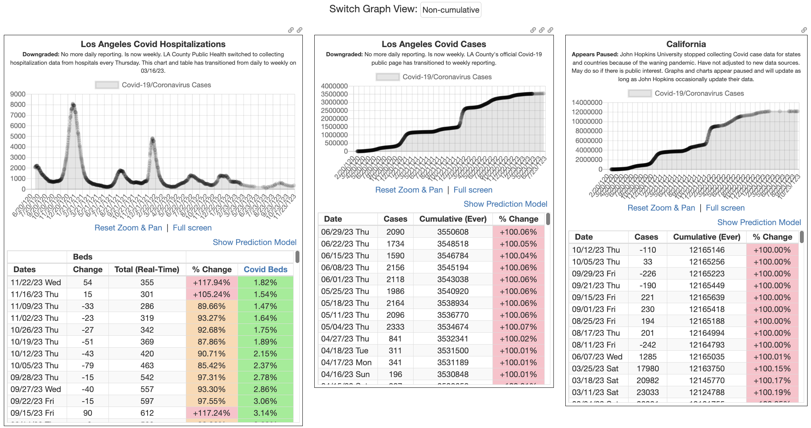

# Covid 19 Tracker

## :page_facing_up: Description:
By Weng Fei Fung (Weng). Quick snapshots of the Covid crisis in the hospitals and populations across county, city, and international levels. Scrapers should be set with cronjobs. The scrapers are PHP or NodeJS depending on the data source.

## :open_file_folder: Table of Contents:
---
- [Description](#page_facing_up-description)
- [Screenshots](#camera-screenshots)
- [Live Demo](#computer-live-demo)

---

## :camera: Screenshots:

## :computer: Live Demo:
<a href="https://wengindustry.com/app/covid19" target="_blank">Check it out</a>
